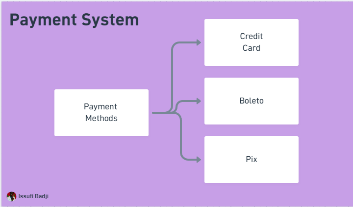

# Strategy Pattern

[](https://github.com/@issufibadji)


Aprenda na prática como usar o padrão de projeto **Strategy** implementando um sistema de pagamentos. O projeto mostra três abordagens progressivas: sem padrão, com Strategy clássico e com Strategy moderno (usando enum + method reference).

## Arquitetura



## Estrutura do projeto

```text
src/
├── NoStrategy.java       # Implementação sem padrão (if/else encadeados)
├── CommonStrategy.java   # Strategy clássico com interface e classes concretas
└── ModernStrategy.java   # Strategy moderno com enum e referência de método
```

## Roteiro

- [x] Sistema de Pagamento sem padrão de projeto
- [x] Com Strategy Clássico (interface + classes)
- [x] Com Strategy Moderno (enum + method reference)
- [x] Conclusão

## As três abordagens

### Sem padrão — `NoStrategy.java`

Toda a lógica de pagamento fica em `if/else` encadeados. Funciona, mas cresce de forma frágil: cada novo método de pagamento exige editar o mesmo bloco.

### Strategy Clássico — `CommonStrategy.java`

Uma interface `PaymentMethod` define o contrato; `CreditCard`, `Boleto` e `Pix` são classes concretas. O `PaymentProcessor` recebe qualquer implementação via injeção de dependência, sem saber qual é.

### Strategy Moderno — `ModernStrategy.java`

Usa um `enum PaymentType` onde cada constante carrega um `Consumer<Double>` apontando para um método estático. Elimina as classes intermediárias e concentra o registro de estratégias em um único lugar.

> Documentação detalhada com comparativo e exemplos de código em [docs/strategy-pattern.md](docs/strategy-pattern.md).

## Como executar

Clone o repositório e execute o arquivo desejado:

```bash
git clone https://github.com/giuliana-bezerra/strategy-pattern.git
cd strategy-pattern

# Sem padrão
javac src/NoStrategy.java && java -cp src NoStrategy

# Strategy clássico
javac src/CommonStrategy.java && java -cp src CommonStrategy

# Strategy moderno
javac src/ModernStrategy.java && java -cp src ModernStrategy
```

Ou abra na IDE de sua preferência (IntelliJ, VS Code) e execute o `main` de cada arquivo.
